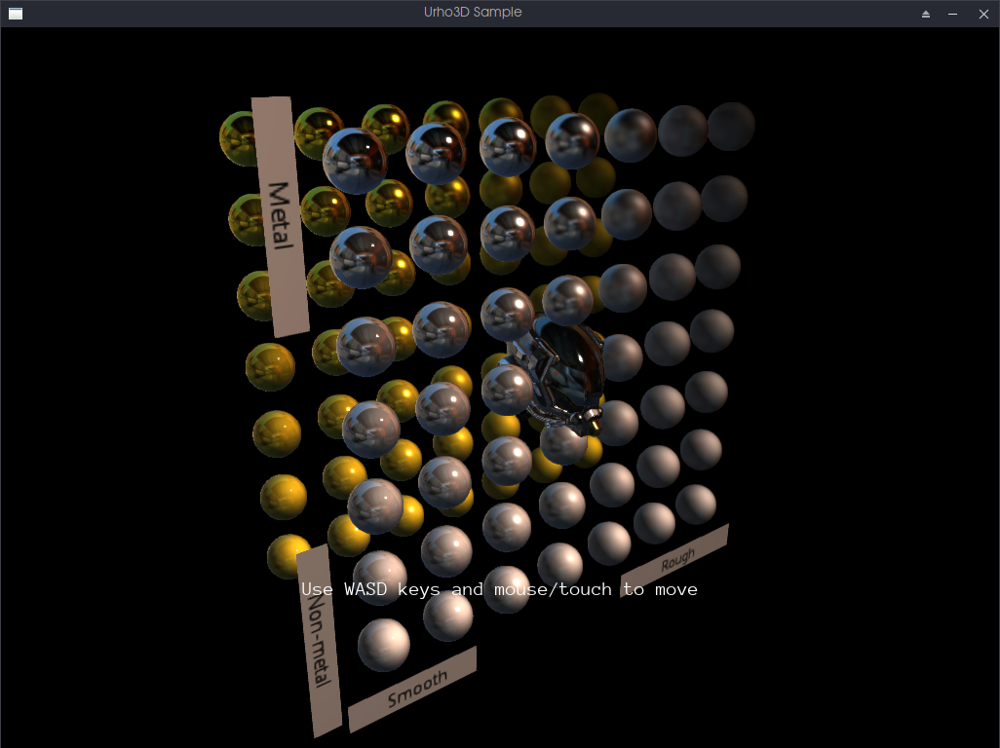

# Urho3D GLTF Loader

An incomplete implementation of glTF for Urho3D. Originaly made for urho-osp.

Includes assets and code from Urho3D and KhronosGroup examples

## Licenses for included assets

Battle Damaged Sci-fi Helmet - PBR by [theblueturtle_](https://sketchfab.com/theblueturtle_), published under a Creative Commons Attribution-NonCommercial license

MetalRoughSpheres - Copyright 2017 Analytical Graphics, Inc. CC-BY 4.0 https://creativecommons.org/licenses/by/4.0/ Model and textures by Ed Mackey.
